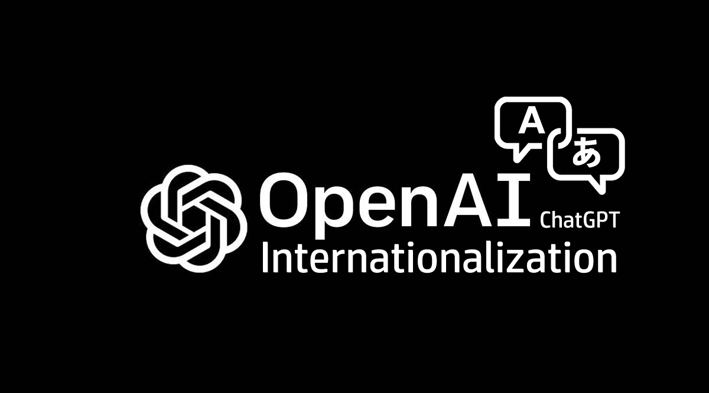
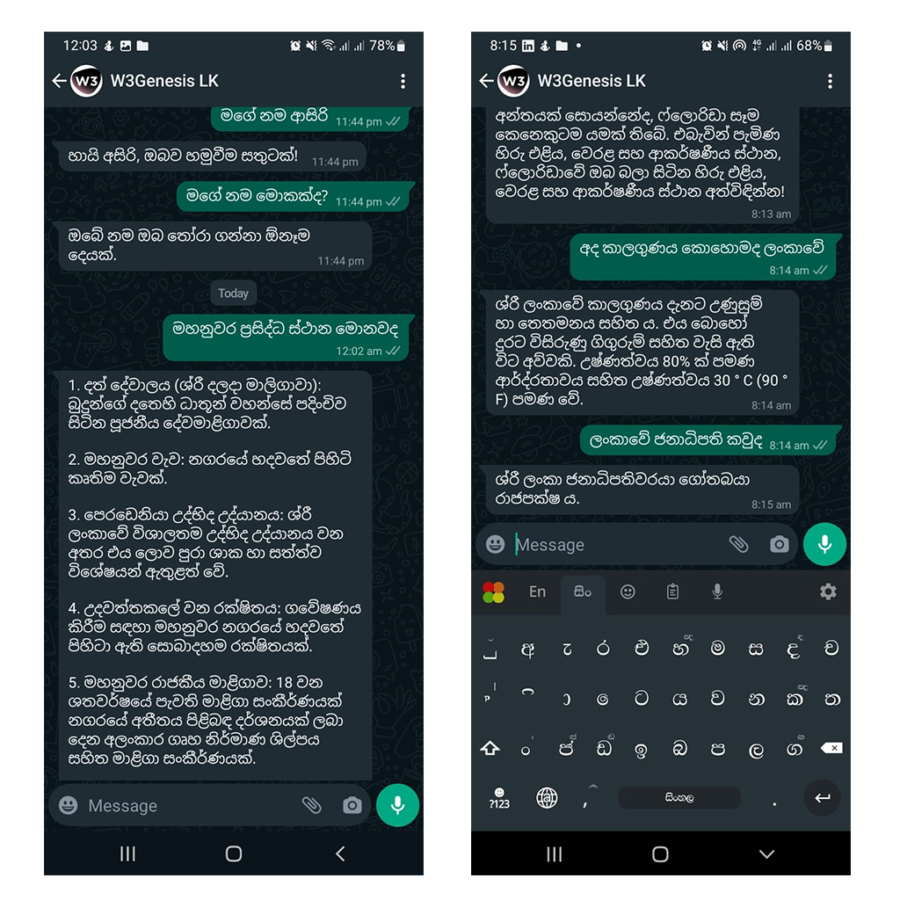

# chatGPT-intl


### Enhanced ChatGPT Wrapper for Internationalization - NodeJS
This NodeJS module acts as a wrapper for ChatGPT API and will help you to use ChatGPT in your own language.


## Installation

Install chatgpt-intl via npm : https://www.npmjs.com/package/chatgpt-intl

```bash
  npm i chatgpt-intl
```

## Usage/Examples
First, you have to obtain your API key from OPENAI, then you can use it here.
```javascript
import ChatGPTIntl from 'chatgpt-intl';

const text = ""
const openAiKey = process.env.OPENAI_API_KEY
const lang = 'en';
const opts = {
    model: "text-davinci-003",
    temperature: 0.9,
    max_tokens: 150,
    top_p: 1,
    frequency_penalty: 0.0,
    presence_penalty: 0.6
};

const response = await ChatGPTIntl(text, openAiKey, opts, lang);
```


## Features

- Use ChatGPT API in your own language
- Ability to customize the chatGPT model
- Supports more than 50 languages

## Limitations

- Does not support for syntax and codes
- Does not support larger text inputs

## Language Support


## Demo
Sample App I created.


## Authors

- [@asirihewage](https://github.com/asirihewage)


## License

[MIT](https://choosealicense.com/licenses/mit/)
